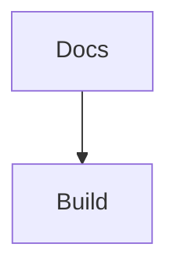

# TDS Course (Docusaurus)

Documentation site for the **Tools in Data Science (TDS)** course.
Built with **Docusaurus 3 + TypeScript + Tailwind**.

## What’s inside

- Course docs + labs (MD/MDX) with local search
- Modern MDX authoring: **Mermaid**, **GFM tables/task-lists**, responsive **video embeds**
- Modern code blocks: Mac-style header + word-wrap toggle + auto-collapse for long snippets
- In-doc **Terminal panel** (iframe-based) for:
  - `localhost` code-server
  - GitHub Codespaces forwarded port URL
  - Any custom `http(s)://` URL
  - Saved connection profiles (stored in browser **IndexedDB**)

## Requirements

- **Node.js 24 LTS** (see `.nvmrc`)
- npm (no Bun)

## Local development

```bash
nvm use 24
npm install
npm start
```

## Quality gates

```bash
npm run lint   # TypeScript typecheck (tsc --noEmit)
npm run build  # Docusaurus production build (outputs ./build)
npm run serve  # Preview the production build
```

Note: Docusaurus is invoked via `node --require ./webpack-fix.js ...` in `package.json` to stay stable on Node 24.

## Authoring (MDX)

### Mermaid

````md

````

### Video embeds

```mdx
<YouTube id="dQw4w9WgXcQ" title="Lecture: Prompt Caching" />

<Video src="/videos/week-3/prompt-caching.mp4" title="Demo" />
```

## Terminal panel UX

- Open via the **Terminal** icon in the navbar or **Ctrl+`**
- (Linux) Install code-server once:
  ```bash
  curl -fsSL https://code-server.dev/install.sh | sh
  ```
- Start code-server locally:
  ```bash
  code-server --auth none --bind-addr 127.0.0.1:8080
  ```
- In the Terminal panel: **Localhost → Port 8080 → Connect**
- Dock modes: **Bottom / Right / Float**
- Transparency slider + Disconnect button
- “Saved sessions” are stored locally in your browser (IndexedDB)

## Deploy

This repo supports **both** GitHub Pages and Cloudflare Pages using env-driven `url/baseUrl`:
- `SITE_URL` (e.g. `https://ORG.github.io`)
- `BASE_URL` (e.g. `/tds-course/` on GitHub Pages, `/` on Cloudflare)

### GitHub Pages

Workflow: `.github/workflows/deploy.yml`
- Uses **Node 24**
- Builds with:
  - `SITE_URL=https://<owner>.github.io`
  - `BASE_URL=/<repo-name>/`

Enable GitHub Pages in repo settings → **Source: GitHub Actions**.

### Cloudflare Pages

Workflow: `.github/workflows/deploy-cloudflare-pages.yml`
- Requires GitHub repo secrets:
  - `CLOUDFLARE_API_TOKEN`
  - `CLOUDFLARE_ACCOUNT_ID`
  - (optional) `CLOUDFLARE_SITE_URL` (defaults to `https://tds-course.pages.dev`)
- Ensure the workflow `projectName:` matches your Cloudflare Pages project.

## License

Content: CC BY 4.0 · Code: MIT
